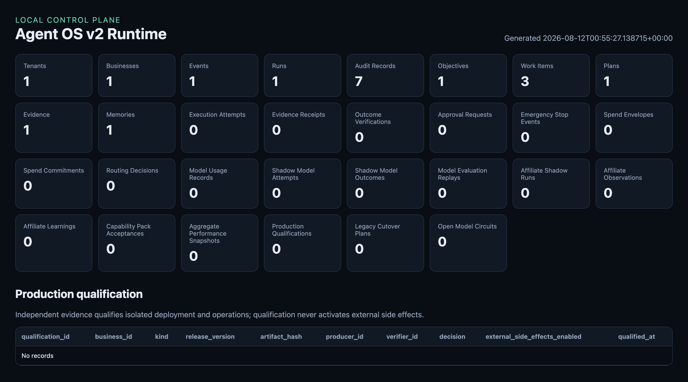

# Chris Kaneshiro

I build AI operations systems that turn messy work into reliable execution.

I bring 15+ years across sales, marketing, and operations, plus practical
automation work since 2015. My focus now is agent systems, workflow automation,
and the controls that make AI useful in real operations: clear authority,
deterministic gates, evidence, rollback, and human approval where it matters.

## Selected work

### [Agent OS Core](https://github.com/Kane808-AI/agent-os-core-showcase)

A headless platform for event-driven business automation. It separates agent
reasoning from policy, approvals, execution, and verification so autonomous
work can be supervised and audited. An approval-gated agent channel ran on it
from July to August 2026, with a human decision releasing every outbound
message.

### [Law Firm OS](https://github.com/Kane808-AI/law-firm-os)

An anonymous architecture case study for AI intake, CRM automation, and a
multi-agent back office in a regulated environment. The repository focuses on
system boundaries and governance, not client identity or data. The intake and
CRM layers run in production today.

### [Deterministic policy gate demo](https://github.com/Kane808-AI/demo-repo)

A small reference repository that shows the core pattern behind my systems:
decide what is allowed, execute only inside that boundary, and verify the
result before reporting completion.

## How I work

- Start with the operating problem, not the model.
- Keep authority and approvals explicit.
- Make important actions recoverable.
- Verify external state instead of trusting a success message.
- Keep client and business data separated by design.

These systems are built by directing AI coding agents against specs I write and
gates I enforce. The design decisions are mine, and every change is
independently verified before it merges.

## Work with me

I take on contract work for teams that need an AI operations system built and
actually running, not a plan for one: agent workflows, intake and CRM
automation, and the approval and verification controls that make those systems
safe to depend on. Engagements run through Brand75.

I am also open to full time roles where I own the same kind of work in house.

Either way the first step is the same. Tell me the operating problem you are
trying to fix and I will tell you what I would build.

Portfolio and contact: https://chriskaneshiro.com

Agency: https://brand75.com
